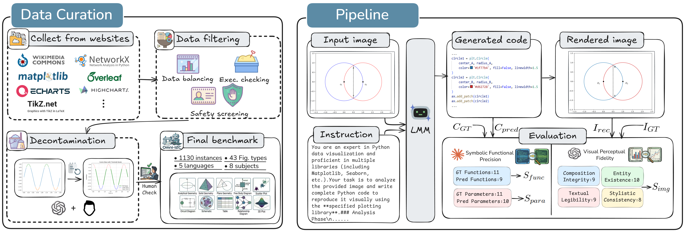

<div align="center">
<h1>Omni-I2C</h1>
<h3>A Holistic Benchmark for High-Fidelity Image-to-Code Generation</h3>

[Hao Wang](https://wanghao9610.github.io)<sup>1,2</sup>,[Limeng Qiao](https://scholar.google.com/citations?user=3PFZAg0AAAAJ&hl=en)<sup>3</sup>,[Zequn Jie](https://scholar.google.com/citations?user=4sKGNB0AAAAJ&hl)<sup>3</sup>, [Zhijian Huang](https://zhijian11.github.io/)<sup>1</sup>, [Chengjian Feng](https://fcjian.github.io/)<sup>3</sup>, 

[Qingfang Zheng](https://openreview.net/profile?id=%7EZheng_Qingfang1)<sup>2</sup>, [Lin Ma](https://forestlinma.com/)<sup>3</sup>, [Xiangyuan Lan](https://scholar.google.com/citations?user=c3iwWRcAAAAJ&hl)<sup>2</sup><sup>:email:</sup>, [Xiaodan Liang](https://scholar.google.com/citations?user=voxznZAAAAAJ&hl)<sup>1</sup><sup>:email:</sup>

<sup>1</sup> Sun Yat-sen University, <sup>2</sup> Peng Cheng Laboratory, <sup>3</sup> Meituan Inc.

<sup>:email:</sup> Corresponding author
</div>

<div align="center" style="display: flex; justify-content: center; align-items: center;">
  <a href="https://arxiv.org/abs/2508.04655" style="margin: 0 2px;">
    
  </a>
  <a href='https://huggingface.co/hao9610/X-SAM' style="margin: 0 2px;">
    
  </a>
  <a href="https://github.com/wanghao9610/X-SAM" style="margin: 0 2px;">
    
  </a>
  <a href="http://47.115.200.157:7861" style="margin: 0 2px;">
    
  </a>
  <a href="http://121.43.252.12:7862" style="margin: 0 2px;">
    
  </a>
  <a href='https://wanghao9610.github.io/X-SAM/' style="margin: 0 2px;">
    
  </a>
</div>

## :eyes: Notice


## :boom: Updates


## :rocket: Introduction
Through an extensive evaluation of 13 proprietary and open-weight LMMs, we reveal a profound performance gap in high-fidelity image-to-code generation. Even leading frontier models, such as Gemini 3 Pro and GPT-5.1, frequently falter in the challenging scenarios presented by our benchmark. These results highlight substantial room for improvement and position Omni-I2C as a challenging benchmark for advancing LMMs. Our contributions are summarized as follows:

- We present **Omni-I2C**, a meticulously curated dataset of 1.1k items, including 5 programming languages, 8 major subjects, and 43 distinct figure types. It serves as a rigorous testbed for evaluating the perception and coding capabilities of LMMs.
- We propose an evaluation framework that assesses code-level integrity and image-level perceptual consistency, enabling more diagnostic and attributable analyses of model behavior than traditional heuristic metrics.
- Our comprehensive analysis of SOTA LMMs exposes a significant performance gap in high-fidelity reconstruction, identifying critical failure modes and charting a path toward more precise, trusted multimodal agents.


## :bookmark: Abstract

We present Omni-I2C, a comprehensive benchmark designed to evaluate the capability of Large Multimodal Models (LMMs) in converting complex, structured digital graphics into executable code. We argue that this task represents a non-trivial challenge for the current generation of LMMs: it demands an unprecedented synergy between high-fidelity visual perception—to parse intricate spatial hierarchies and symbolic details—and precise generative expression—to synthesize syntactically sound and logically consistent code. Unlike traditional descriptive tasks, Omni-I2C requires a holistic understanding where any minor perceptual hallucination or coding error leads to a complete failure in visual reconstruction.

Omni-I2C features 1.1k meticulously curated samples, defined by its breadth across subjects, image modalities, and programming languages. By incorporating authentic user-sourced cases, the benchmark spans a vast spectrum of digital content—from scientific visualizations to complex symbolic notations—each paired with executable reference code. To complement this diversity, our evaluation framework provides necessary depth; by decoupling performance into perceptual fidelity and symbolic precision, it transcends surface-level accuracy to expose the granular structural failures and reasoning bottlenecks of current LMMs. Our evaluation reveals a substantial performance gap among leading LMMs; even state-of-the-art models struggle to preserve structural integrity in complex scenarios, underscoring that multimodal code generation remains a formidable challenge.

## :mag: Overview



## :bar_chart: Benchmarks

Please refer to the [Benchmark Results](docs/benchmark_results.md) for more details.

### 1. Structure
We provide a detailed project structure for Omni-I2C. This project consists of two main components: **VLMEvalKit_infer**, which is adapted from VLMEvalKit for inference, and **eval_pipeline**, designed for the evaluation process. Please follow this structure to organize the project.

<details open>
<summary>📁 Structure (Click to collapse)</summary>

```bash
Omni-I2C
├── doc
│   ├── images
│   └── results
├── eval_pipeline
│   ├── eval_image_prompt.py
│   ├── eval_prompts.py
│   ├── gt_data
│   ├── libs
│   ├── main_pipeline.py
│   ├── pipeline_config.py
│   ├── run_main.sh
│   ├── step1_execute.py
│   ├── step2_evaluate.py
│   └── step3_evaluate.py
├── README.md
├── requirements.txt
└── VLMEvalKit_infer
    ├── assets
    ├── docs
    ├── LICENSE
    ├── requirements
    ├── run_example.sh
    ├── run.py
    ├── scripts
    ├── setup.py
    ├── vlmeval
```
</details>

### 2. Installation
We provide a detailed installation guide to create an environment for **Omni-I2C**. Please refer to the following steps to set up the environment, especially for next-gen hardware support (e.g., RTX 5090).

<details open>
<summary>⚙️ Installation (Click to collapse)</summary>

```bash
# 1. Clone Omni-I2C
git clone [https://github.com/MiliLab/Omni-I2C.git](https://github.com/MiliLab/Omni-I2C.git)
cd Omni-I2C/VLMEvalKit_infer

# 2. Create conda environment (Python 3.10.18 recommended)
conda create -n omni_i2c python=3.10.18 -y
conda activate omni_i2c

# 3. Install PyTorch & CUDA
# We recommend CUDA 12.8 for best driver support on next-gen hardware (e.g., RTX 5090).
pip install torch==2.8.0 torchvision==0.23.0 torchaudio==2.8.0 --index-url [https://download.pytorch.org/whl/cu128](https://download.pytorch.org/whl/cu128)

# 4. Install Flash-Attention 2 (v2.8.3)
git clone -b v2.8.3 [https://github.com/Dao-AILab/flash-attention.git](https://github.com/Dao-AILab/flash-attention.git)
cd flash-attention

# [Option A] Standard installation
MAX_JOBS=4 pip install flash-attn --no-build-isolation

# [Option B] Optimized for Blackwell Architecture (Recommended for RTX 5090)
# export TORCH_CUDA_ARCH_LIST="12.0" 
# MAX_JOBS=4 pip install flash-attn --no-build-isolation

cd .. # return to VLMEvalKit_infer directory

# 5. Install VLMEvalKit_infer
pip install -e .

# Install Acceleration Backend (Choose one)
# [LMDeploy]
pip install [https://github.com/InternLM/lmdeploy/releases/download/v0.11.1/lmdeploy-0.11.1+cu128-cp310-cp310-manylinux2014_x86_64.whl](https://github.com/InternLM/lmdeploy/releases/download/v0.11.1/lmdeploy-0.11.1+cu128-cp310-cp310-manylinux2014_x86_64.whl) --extra-index-url [https://download.pytorch.org/whl/cu128](https://download.pytorch.org/whl/cu128)

# [vLLM]
uv pip install vllm==0.11.0

# 6. Install Omni-I2C (Evaluation Pipeline)
cd .. # Go back to project root (Omni-I2C)

# Install Python requirements for evaluation
pip install -r requirements.txt

# --- System Dependencies for Evaluation (Requires sudo) ---
# Update source
sudo apt-get update

# Install LaTeX environment (Required for TikZ & standalone)
sudo apt-get install -y texlive-latex-base texlive-latex-extra texlive-pictures texlive-fonts-recommended

# Install PDF to Image tools (Required for pdftocairo)
sudo apt-get install -y poppler-utils

# Install the Google Noto font package (covering Chinese, Japanese, Korean, Arabic, Russian, etc.)
sudo apt-get install -y fonts-noto fonts-noto-cjk fonts-noto-color-emoji

# --- Playwright Setup ---
# Install Chromium and system dependencies
playwright install chromium
playwright install-deps
```

</details>

### Reference

VLMEvalkit is built upon the [OpenCompass VLMEvalKit](https://github.com/open-compass/VLMEvalKit).


### 3. Data Preparing
The datas that need to be prepared are the inference data and the ground truth data for evaluation.

#### Inference Data
First, download the inference data from [Link](xxx). After downloading, you need to update the file path in the configuration:

1. Open `Omni-I2C/VLMEvalKit_infer/vlmeval/dataset/image2code.py`.
2. Locate **line 18** and replace the default path `Image2Code_Full.tsv` with your actual local path.

```python
# Omni-I2C/VLMEvalKit_infer/vlmeval/dataset/image2code.py

# ... (Previous code)
# Line 18: Change 'Image2Code_Full.tsv' to your local path
'Image2Code_Full': '<Your folder>/Image2Code_Full.tsv',
# ...

```

#### Ground Truth Data

The ground truth (GT) data is already included in the repository (`Omni-I2C/eval_pipeline/gt_data/gt_data.tar.gz`). Please unzip it before running the evaluation pipeline.

```bash
cd ./eval_pipeline/gt_data
tar -xzvf gt_data.tar.gz

```

### 4. Infering & Evaluation


## :white_check_mark: TODO
- [x] Release the [Online Demo](http://47.115.200.157:7861).
- [x] Release the [Model Weights](https://huggingface.co/hao9610/X-SAM).
- [x] Release the [Technical Report](https://arxiv.org/abs/2508.04655).
- [x] Release the code for [Training LLaVA-based MLLMs](#llava).
- [x] Release the code for [Evaluation on All VLM Benchmarks](#evaluate-on-all-vlm-benchmarks).
- [x] Release the code for [Demo Deployment](#computer-demo).
- [x] Release the code for [Evaluation on All Segmentation Benchmarks](#evaluate-on-all-segmentation-benchmarks).
- [x] Release the code for [Training X-SAM](#stage-3-mixed-fine-tuning).
- [x] Release the code and weight for X-SAM with Qwen3.
- [ ] Relaese the inference and demo code supporting transformers.
- [ ] Release the code and instructions for training with Ascend NPU.
- [ ] Release the code and weight for X-SAM with Qwen3VL.

## :blush: Acknowledge
This project has referenced some excellent open-sourced repos ([xtuner](https://github.com/InternLM/xtuner), [VLMEvalKit](https://github.com/open-compass/VLMEvalKit), [Sa2VA](https://github.com/magic-research/Sa2VA)). Thanks for their wonderful works and contributions to the community.

## :pushpin: Citation
If you find X-SAM is helpful for your research or applications, please consider giving us a star 🌟 and citing it by the following BibTex entry.

```bibtex
@article{wang2025xsam,
  title={X-SAM: From Segment Anything to Any Segmentation},
  author={Wang, Hao and Qiao, Limeng and Jie, Zequn and Huang, Zhijian and Feng, Chengjian and Zheng, Qingfang and Ma, Lin and Lan, Xiangyuan and Liang, Xiaodan},
  journal={arXiv preprint arXiv:2508.04655},
  year={2025}
}
```

<!-- ## :star2: Star History

<a href="https://www.star-history.com/#wanghao9610/X-SAM&Date">
 <picture>
   <source media="(prefers-color-scheme: dark)" srcset="https://api.star-history.com/svg?repos=wanghao9610/X-SAM&type=Date&theme=dark" />
   <source media="(prefers-color-scheme: light)" srcset="https://api.star-history.com/svg?repos=wanghao9610/X-SAM&type=Date" />
   
 </picture>
</a> -->